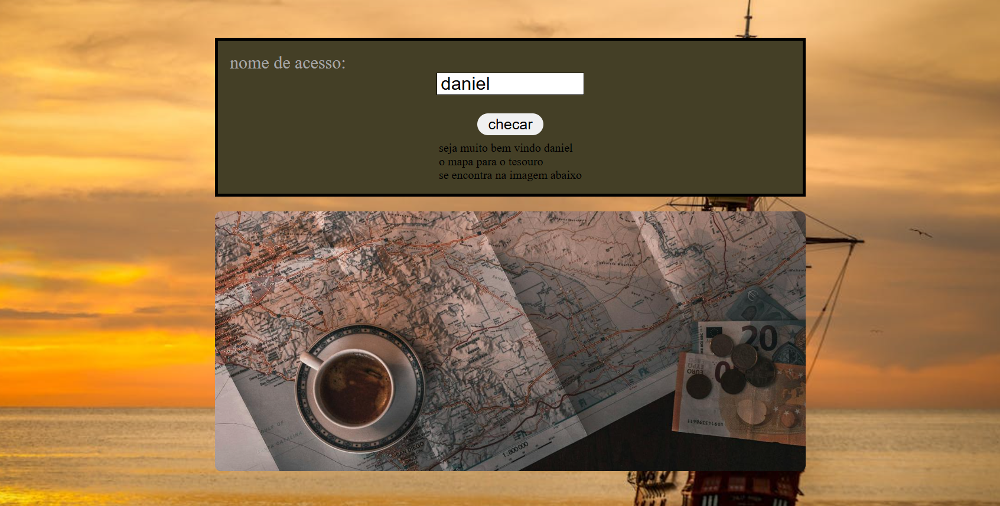

# Projeto

## Sobre
criaçao de uma confirmaçao de nome especifica, projeto criado com o foco de desenvolver minhas habilidades na linguagem de Javascript com base em meus conhecimentos.

## Dificuldades
encontrei dificuldade em alguns pontos, como por exemplo pegar o valor que seria acrecentado dentro do input e o uso da imagem quando aparece o erro.

## Tecnologias usadas

